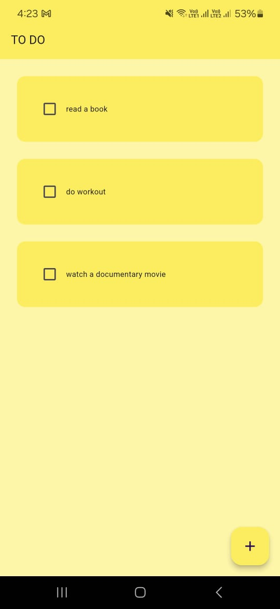

# TODO App

TODO list application, leveraging Hive for efficient local data storage.

## Overview

The TODO app allows users to manage tasks efficiently with the following features:

- **Task Management:** View, add, mark as complete, and delete tasks.
- **Persistent Storage:** Utilizes Hive for local database management, ensuring data persistence across app sessions.
- **User Interface:** Simple and intuitive user interface built using Flutter's material design widgets.
- **Customizable:** Easily adaptable to add more features and customize according to specific needs.

## Screenshots

Here are some screenshots of the TODO app in action:

### Task List Screen

### Adding a Task

### Task Details

### app icon

## Features

- **Task List:** Display tasks with checkboxes to mark completion status.
- **Add New Task:** Add new tasks using a floating action button.
- **Toggle Completion:** Mark tasks as complete or incomplete with a tap.
- **Delete Task:** Remove tasks from the list with swipe gestures or delete buttons.

## Dependencies

This project uses the following dependencies:

- `flutter/material.dart`: Flutter's material design widgets for building the UI.
- `hive_flutter`: Hive database for efficient local storage of task data.
- Custom utilities for dialogs (`dialog_box.dart`) and task list tiles (`todo_tile.dart`).

## Installation

To run this project locally:

1. Clone this repository to your local machine.
2. Ensure you have Flutter installed. If not, follow the [Flutter installation guide](https://flutter.dev/docs/get-started/install).
3. Run `flutter pub get` to install dependencies.
4. Connect your device or start an emulator.
5. Run `flutter run` to build and launch the app on your device/emulator.

## Contributing

Contributions are welcome! If you want to contribute to this project, feel free to fork this repository, make your changes, and submit a pull request.

